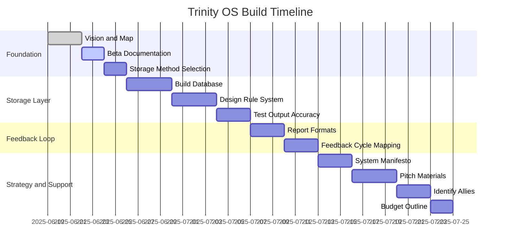

# Trinity OS – Build Roadmap

This document tracks the key phases of the Trinity OS build, organized in a manageable timeline. Overseen by Lumen.

---

## Phase Breakdown

### 1. Foundation and Clarity (Week 1)
- [ ] Define Vision and System Map
- [ ] Document Current Beta Build (Intake Flow)
- [ ] Select Short-Term Storage Method

### 2. Storage and Analysis Layer (Week 2)
- [ ] Build Initial Database or Backend
- [ ] Design Rule-Based Analysis System
- [ ] Test and Validate Output Accuracy

### 3. Feedback and Insight Loop (Week 3)
- [ ] Design Report and Dashboard Formats
- [ ] Map Feedback Cycle (User to Response)

### 4. Story and Strategy (Week 4)
- [ ] Write System Manifesto (Mythic + Technical)
- [ ] Prepare Ally Pitch Deck and Materials

### 5. Build Support System (Week 5)
- [ ] Identify Tech Allies
- [ ] Outline Budget and Funding Needs

---

## Gantt Visualization (Mermaid Syntax)
Use this with Mermaid live editor or static site generator.

---

## Build Principle

We don’t build all at once — we build in orbitals.  
Each phase strengthens the core and informs the next.  
This is a modular architecture of trust and truth, not code alone.
